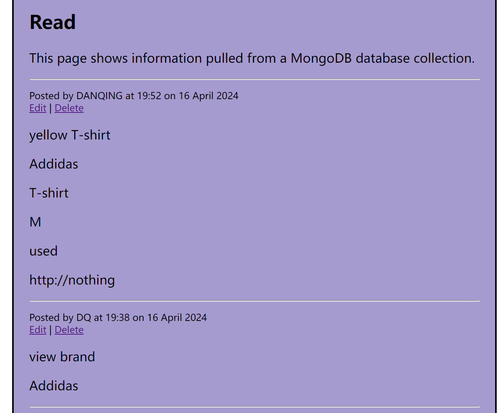

# Web App Workshop --- Clothes Exchange App

## Description:
- The Clothes Exchange App is an innovative platform designed to promote sustainable fashion and extend the life cycle of garments. It serves as a virtual marketplace where users can effortlessly swap, trade, or exchange their clothing with others. This app not only encourages a more eco-friendly approach to fashion but also offers an economical solution for refreshing one's wardrobe without the need to purchase new items.
- Users of the Clothes Exchange App can list their garments, providing details such as type, brand, size, condition, and images, making it easy for others to browse and select items of interest. It's a community-centric tool that fosters a cycle of reuse, reducing waste and the carbon footprint associated with the production of new clothing.
- The app is intuitive and user-friendly, enabling members to navigate through listings, post their own items, and engage in exchanges with confidence and ease. By harnessing the power of technology, the Clothes Exchange App brings together fashion enthusiasts who share a common goal: to make style sustainable. Whether you're looking to declutter your closet, find a unique piece, or simply participate in a movement towards more responsible consumption, the Clothes Exchange App is your go-to destination for all things fashion and sustainability.

Here are some screenshots of the Web App
1. Home Page:
Home page shows the function buttons, App description, and code sources:
Functions: 
App description: 
Code sources: 

2. Login Page:

3. Create Posts:
Create a post page: 

4. View All the Posts:

5. Delete Posts:
Users can't delete the post that are not post by themselves. It will show an error page when deleting: 

## A link to the deployed copy of your app
Local link: http://127.0.0.1:5000/
i6 link: https://i6.cims.nyu.edu/~dc4829/7-web-app-dianachen1013/flask.cgi
The picture shows to connect by using i6: 
This is a solo work by Name: Danqing Chen, NYU Net ID: dc4829
